# Workshop 2: How to Build a Machine Learning Model with the Visual Interface for Azure Machine Learning Service - Predict Wine Quality

In this workshop, you will learn how to build a machine learning model to predict the quality of wine with the visual interface for [Azure Machine Learning Service](https://studio.azureml.com/). We will use an example case study, with the Data Science Lifecycle as guideline. You will first look at the Business Understanding, proceed with the Data Acquisition and Understanding. Then you will start the Modeling part, the Deployment, and finally the Customer Acceptance part. We will first introduce every step, and then elaborate on the corresponding visual interface components to fulfil the step.

*Note: we assume you have basic machine learning knowledge, as this workshop only looks at the tooling and not on the underlying techniques.*

# Prerequisites

* Azure Pass or subscription
* Machine Learning Workspace. You can create such workspace by going to the [Azure Portal](https://portal.azure.com) and click on Create new resource, and search for Machine Learning:

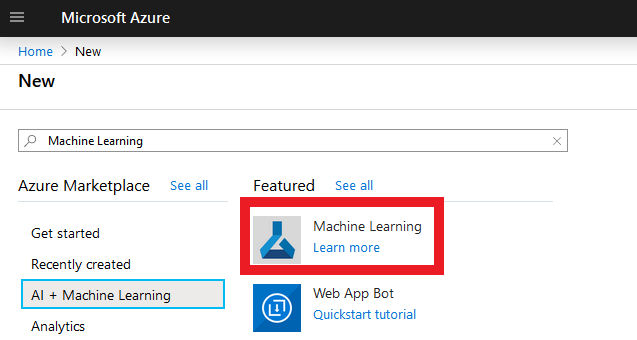

From your Machine Learning Workspace, you can launch the visual interface:

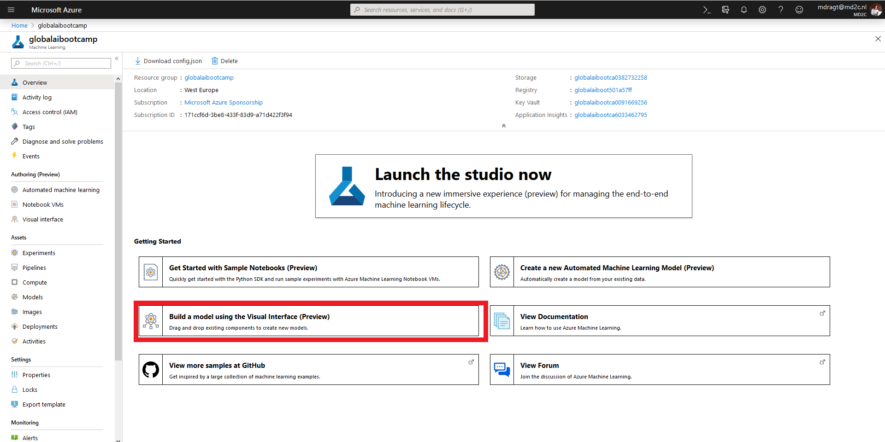

# Visual Interface for Azure Machine Learning Service

## Case description: Cheers!

In this case, you want to predict the quality of wine. We used a dataset from UCI Machine Learning repository that contained 6497 observations with physicochemical properties of red and white Portuguese wine and their quality (Cortez).

## Visual Interface for Azure Machine Learning Service

With the visual interface for Azure Machine Learning Service, developers and data scientists van quickly build, test, develop, deploy, and consume predictive models using state-of the art machine learning algorithms in an interactive visual workspace.


It is organized as follows:

* Experiments: a list of experiments that you have created.
* Web Services: a list of experiments that you have published as a webservice.
* Datasets: the datasets that you have uploaded and a list of sample datasets.

In order to develop a predictive model, you will need the data. This can come from various sources. Furthermore, you probably want to transform and analyse the data before you can use it to train the model. Therefore, this visual interface contains several components: the modules. In this case study, you will use several of these components.

## Components of an Experiment

* Saved Datasets: contains your uploaded datasets, as well as the provided samples
* Data Format Conversions: contains the module to convert your output to CSV
* Data Input and Output: contains the modules to enter the data manually, export the data, or import the data
* Data Transformation: contains the modules to manipulate, sample and split, and scale and reduce the data
* Machine Learning: contains the modules to initialize the model, train the model, score, and evaluate the model
* Python Language Modules: contains the modules to create a Python model, and the execute Python script
* R Language Modules: contains the module to execute R script
* Text Analytics: contains the modules to extract n-gram features, feature hashing, and to preprocess text.
* Web Services: contains the modules to define the input and output ports of you model.

# Data Science Lifecycle

## Business Understanding

In this part of the lifecycle, there are two main goals. First, you have to define the objectives, and second, you have to identity data sources.

To define the objectives, you have to identify the business problem first. An important part of defining the objective, is defining the target variable, or dependent variable, and identifying key variables. To find key variables, we highly recommend you to look at the existing body of knowledge regarding your objective. You are probably not the first person that has this problem. Based on that, you can formulate business goals by defining "sharp" questions that are relevant, specific, and unambiguous, which you can answer with the key variables that you identified.

Then you are ready to identify our data sources, containing the prior defined target and key variables.
Although in this case you work with a sample dataset, it is always a nice exercise to elaborate these steps for yourself, although in real life you would work with your customer and other stakeholders.

Case: Regarding the wine quality, you would like to understand whether you could predict the quality of the wine, or if the wine is good or bad. For now, you only want to know whether a wine is good or not. And by good we mean a quality score of 6 or higher. By creating such a model, you could predict the quality based on the physicochemical properties by taking a sample, and hence adapt i.e. the price.

## Data Acquisition and Understanding

In this part of the lifecycle, there are two main goals. First, you want to produce a clean, high-quality data set with the key variables and the target variables. Make sure that the location of the data set is in such way, that you are ready to access it.

Secondly, it’s time to start thinking about a solution architecture of the data pipeline. Because in order to obtain such clean, high-quality data set, you will have to ingest and clean the data programmatically to make it repeatable. And for future steps, you also want to make sure that new data is processed the same way, maybe engineer features, and score your data set by your -yet to be developed- models. Finally, you want to story your results and share them with your customer.

### Data Acquisition

You start with ingesting the data, for which you have three options:

* Upload a dataset
* Enter data manually
* Import data

Once you have the data, you can start inspecting it, and start the pre-processing part to obtain a clean, high-quality data set.

We obtained the data from the UCI Machine Learning repository website and combined the red and white datasets. This can be found in the additional GitHub repo [Wine Quality: Data ingest and exploratory data analysis](https://github.com/mdragt/WineQuality) that can be used for this workshop. The dataset will be prepared so you can upload it to the Visual interface (preview) for Azure Machine Learning Service.

*Note: this dataset is from a GitHub repo, meaning that it might be updated every now and then.*

To upload the dataset:

* Click on + New at the left bottom of the page.
* Select Datasets
* Select Upload from Local File and select the local datafile from the GitHub repository.


Now you are going to create e new experiment.

* To start a new experiment, click + New left at the bottom of the window.
* Select the option to create a Blank Experiment. This will create a new experiment and will show you the canvas where you can drag your modules on.
* Rename the experiment.


As you have uploaded the dataset, you can now find it under My Datasets. Drag it on the canvas.

### Understanding the data

You have various options to inspect the data. First, you could use the “visualize” option to get a generic idea of the data. In the preparation of the dataset, some data visualizations are included, as you are very flexible to program your own graphs. But you have also the option to inspect the data you have dragged on the canvas. Currently, you have to select all the columns of your dataset and use the “Visualize” option by right-clicking on the output port.

* Drag the Select Columns in Dataset on the canvas
* Connect it to the dataset module by selecting the output port of the dataset module and dragging an arrow to the input of the Select Columns module
* Select the With Rules option
* Begin with All Columns to obtain all the columns from the dataset

In order to see the results, you first have to run the experiment.

* Click on Run at the bottom of the window
* Select of create the compute target
* Click on run

This might take a while, especially when you have created a new compute target. To run this, you would need to create a compute of the type “Machine Learning Compute”.

After running the experiment, you are ready to inspect the data.

* Right-click on the output port of the Select Columns Dataset
* Select the Visualize option

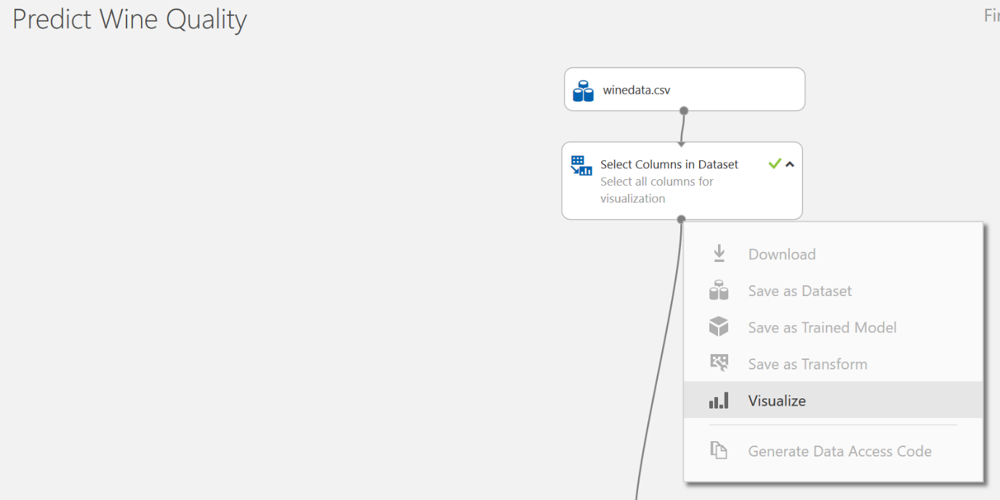

This will give you an interactive overview of your data with standard statistics like mean, median, standard deviation, missing values, unique values, and the data type. Besides, it gives you information about the distribution, using a bar chart, or a boxplot.

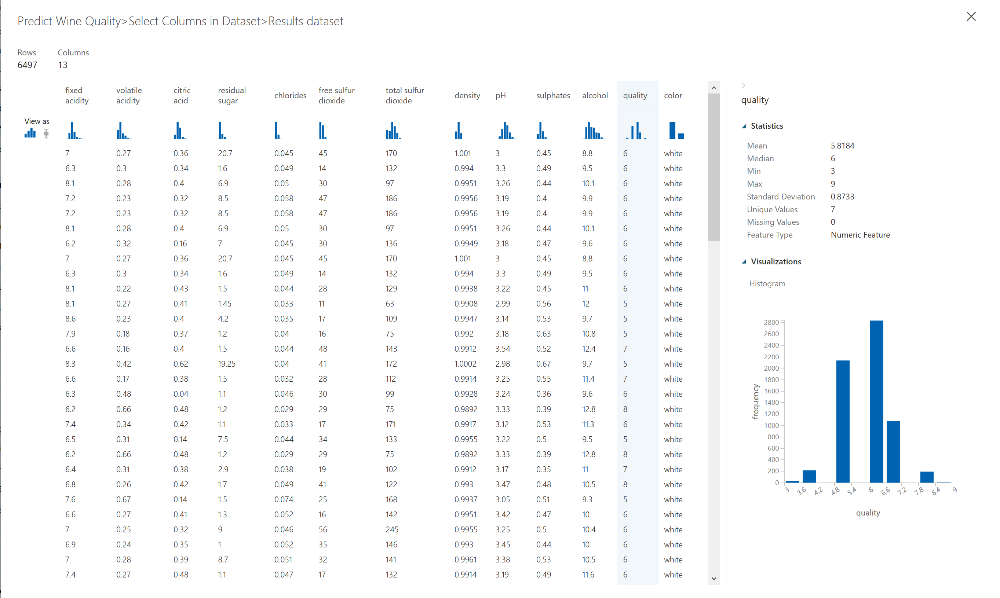

In this case, we show the distribution of “quality”.

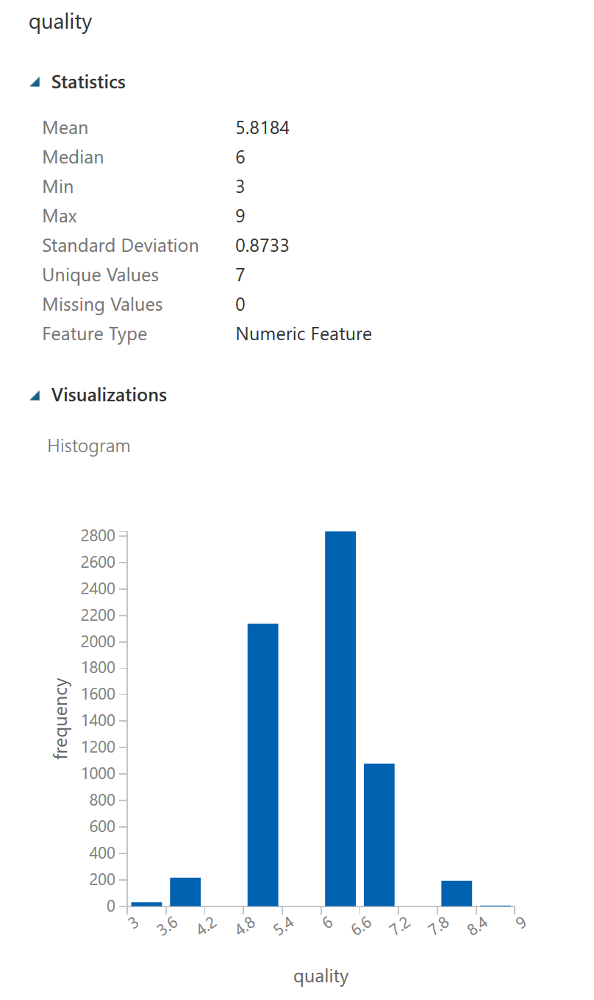

## Modeling

In this part of the lifecycle, there are three main goals. First, you want to determine which are the optimal data features for the machine-learning model. Secondly, you want to create an informative machine learning model that predicts the target variable most accurately. And finally, you want to create a machine learning model in such way, that's suitable for production.

In order to find the optimal data features, you will focus on feature engineering. Feature engineering involves the inclusion, aggregation, and transformation of the key variables to create the features that you can use to predict your target variable with. It can be discussed whether this step takes place in the visual interface, or before, in the prior step.

In order to create an informative machine learning model, you have to train a model with a specific algorithm. This algorithm depends on the type of question you are trying to solve.

Before you train the model, you will split the data into a training and a test data set. You will train the model with the training data set only.

In order to decide whether our model is suitable for production, you will use the test data set and score it with our trained model. You can now evaluate how well our model did.

### Feature Engineering

During the data preparation, we already created the variable “color” as we are dealing with white and red wine. Now you will also create our dependent variable, based on “quality”. In this case, you are interested to find out whether the wine is good (quality is equal or higher than 6) or bad (quality lower than 6). You can create this new variable with either the Execute Python Script or Execute R Script. We used the latter. This module already contains a preformatted function azureml_main.

*Note: this is just to show you the possibilities of the visual interface, as the variable “qual_bool” already exists in the dataset.*

* Drag the Execute R Script on the canvas and connect it to the Select Columns in Dataset module
* Substitute the preformatted code with the code below
* Run the experiment

```r

# R version: 3.5.1
# The script MUST contain a function named azureml_main
# which is the entry point for this module.
azureml_main <- function(dataframe1, dataframe2){
  print("R script run.")
  dataframe1$qualityBool <- ifelse(dataframe1$quality<6,0,1)
  # Return datasets as a Named List
  return(list(dataset1=dataframe1, dataset2=dataframe2))
}

```

Now you have a Boolean that contains a 1 when the original quality of the wine was 6 or higher, and 0 if the quality was below that level.

In the next step you have to remove the original quality variable. Therefore, use the Select Columns module, and exclude the quality variable.

* Drag the Select Columns from Dataset on the canvas and connect it to the Execute R Script module
* Select the With Rules options
* Begin with All Columns
* Exclude by using column names and select the variable “quality” and “qual_bool”.
* Run the experiment
  


If you now inspect the dataset, you will see that you don’t have the original dependent variable quality anymore. As from now, you will focus on the newly created dependent variable qualityBool.

### Splitting the data

Now you are ready to split the data in 70% for the training data, and 30% for the testing data. You are also taking the color of the wine into account.

* Drag the Split Data module on the canvas and connect it to the Select Columns in Dataset module
* Select Split Rows as Splitting mode
* Enter 0.7 to create a training dataset containing 70% of the data, which will be in the left output port, and 30% of the data for the test dataset, which will be in the right output port
* Use a Randomized split and set Random seed to any number you want to make this split procedure reproducible
* Set the Stratified split to True and select the variable color. This will split the dataset proportionally, taking the variable color into account.
* Run the experiment


As a result, you now have 70% of your data for testing coming from the left output port (1) and 30% of your data for testing coming from the right output port (2). If you check both datasets, you will see that the original distribution of the variable color has been maintained.

### Train the model

With the training data, you will now train the model. You have to choose an algorithm and in this case we used the Two-Class Boosted Decision Tree.

* Drag the Train Model module on the canvas and connect the right input port to the left output port of the Split Data module, which contains the training data,
* Select the variable qualityBool as the dependent variable
* Drag the Two-Class Boosted Decision Tree on the canvas and connect it to the left input port
* Leave the standard hyperparameters as they are, but set a seed to make it reproducible
* Run the experiment

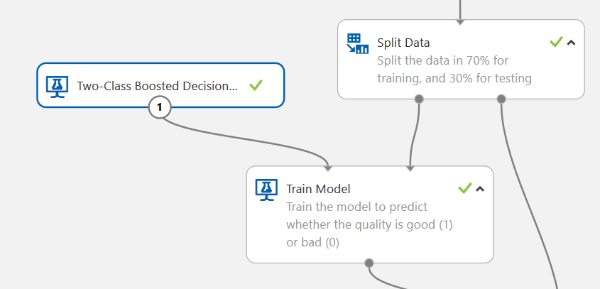

### Score the test data

With the trained model, you are now ready to score the 30% of the data that you took from the original dataset to test.

* Drag the Score Model module on the canvas and connect the output of the Train model module to the left input port, and the right input port from the Split Data module that contains the test data, to the right input port.
* Run the experiment


When you visualize the results of this module, you will find two extra columns in the dataset: Scored Labels and Scored Probabilities. When the results of the Scored Probabilities are 0.5 or higher, the Scored labels will be 1, when the Scored Probabilities is lower, the Scored Labels will be 0. In other words, the wines that are predicted as good wines get the label 1, and the wines that are predicted to have a bad quality, get the label 0. Please note that you could of course change this “final prediction” by using a script that uses another threshold as cut-off.

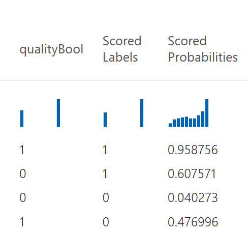

### Evaluate the model

Now you are ready to evaluate the model that you have trained in combination with the scored testdata.

* Drag the Evaluate Model on the canvas and connect the Score Model module to the left input port of the Evaluate Model module. You can use the right input port to connect it to other model outputs, so you can compare model performance.
* Run the experiment

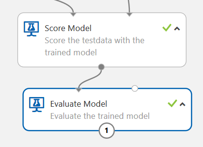

When inspecting the results by using the visualization option, you will get and ROC graph and some performance metrics.


Be critical here: it might be nice to see that you have reached 77% of accuracy here, but always go back to your original dataset and ask yourself the question whether this accuracy score is better that “just” applying the central measures of tendency.

## Deployment

In this part of the lifecycle, there is one main goal. You want to deploy our prior develop model, with a data pipeline to a production or production-like environment for final user acceptance.

### Create a Predictive Experiment

When you are satisfied with your model quality, you have to option to create a predictive experiment.

* Click on Create Predictive Experiment. You will be only allowed to click on this button if you have successfully run the experiment.

This will create a new experiment that is linked to your training experiment.

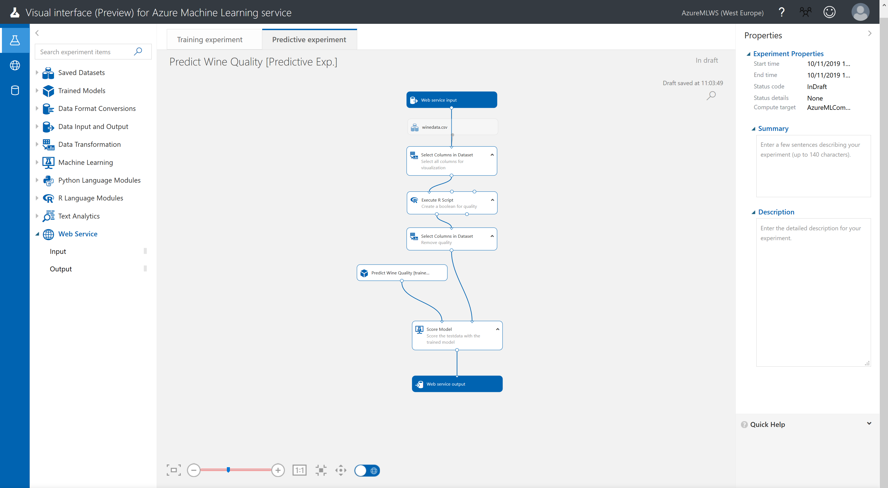

One important step to conduct before you can deploy this model, is eliminating the dependent variable from your model. When you want to make predictions based on new data, this is exactly the variable you don’t have!

* Select the second Select Columns from Dataset module
* Enhance the rule, indicating that you also want to exclude the variable qualityBool

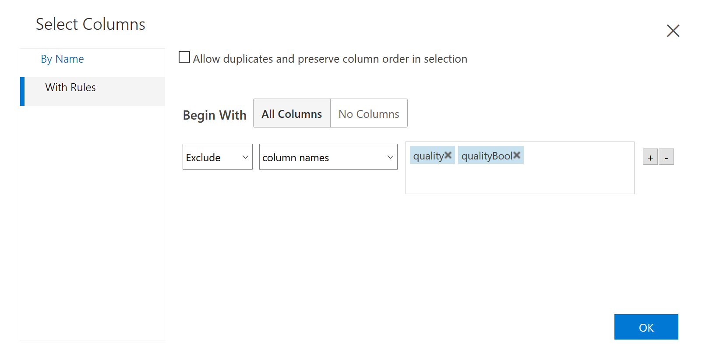

* Connect the Web service input directly to the Score Model module
* Run the model


### Deploy the Web Service

The final step would be de deployment of the model. Just click on the Deploy Web Service at the bottom of the window, and you are done! Well, almost. For the deployment, you need to create a compute with the type “Kubernetes Service”.

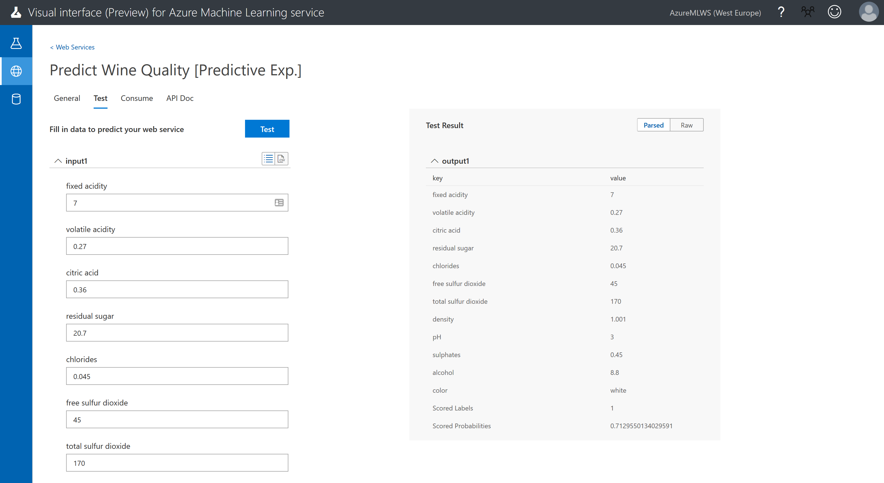

Under Web Services, you can now find the deployed model, and you can test it. Here you can also find general information about the deployment, information about how to consume your model, including code samples, and documentation about the API.

## Customer Acceptance

With this part of the lifecycle, you conclude our story. In this step, you want to make sure that you have finalized the project deliverables and confirm that the pipeline, the model, and their deployment in a production environment satisfy the customer's objectives.

At the end, you have to be able to answer your business objectives from the first step of this lifecycle.

### Presenting the Prediction Results

Finally, you have to think about our customers. In most cases, you cannot just show them JSON output. In order to present the prediction results, you can collaborate with a developer. And hopefully Microsoft will soon create a connection to Power BI for these models that are deployed with the visual interface too.

# Summary

In this workshop you learned how to build a classification model with the new visual interface for Azure Machine Learning Service.

# Source

## Environment

* Visual Interface for Azure Machine Learning: https://studio.azureml.com
* Azure platform: https://portal.azure.com

## Raw data and additional information

Paulo Cortez, University of Minho, Guimarães, Portugal, http://www3.dsi.uminho.pt/pcortez 
A. Cerdeira, F. Almeida, T. Matos and J. Reis, Viticulture Commission of the Vinho Verde Region(CVRVV), Porto, Portugal